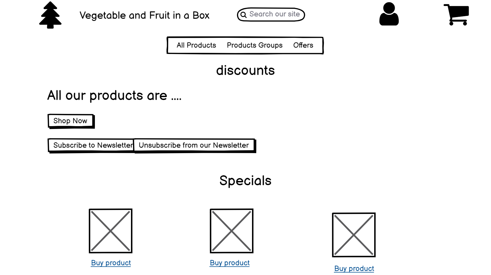

# Milestone Project 4
***


## Table of Contents:
 * [What does it do and what does it need to fulfill?](#what-does-it-do-and-what-does-it-need-to-fulfill)
 * [Functionality of Project](#functionality-of-project)
 * [User Experience](#user-experience)
    * [User Stories](#user-stories)
    * [Design](#design)
        * [1. Font](#1-font)
        * [2. Color Scheme](#2-color-scheme)
        * [3. Logo](#3-logo)
 * [Wireframes](#Wireframes)
 * [Technology Used](#technology-used)
 * [Database](#database)
 * [Features](#features)
    * [Future Features](#future-features)
    * [Defensive Design](#defensive-design)
 * [Testing](#testing)
    * [Found Bugs & Fixes](#found-bugs--fixes)    
 * [Deployment](#deployment)
 * [Credits](#credits)
    * [Special Thanks & Acknowledgements](#special-thanks--acknowledgements)

***


## What does it do and what does it need to fulfill?
This Project showcases what we have learnt so far as part of the Fullstack Developer course from Code Institute.
The application is an e-commerce shop for organic and locally sourced products.
The shop as such needs to fulfill the needs of:

 1. Guest Customer
 2. Member Customer
 3. Shop's Owner/Admin

### Functionality of Project
The application is built using Django, an open-source python web framework used for rapid development, pragmatic, maintainable, clean design, and secure websites. 
One of the main characterisitc of  Django framework is to allow developers to focus on components of the application that are new, instead of spending time on already developed components.

Sqlite 3 has been used as the testing and local development database, before deploying on Heroku. SQLite is a C-language library that implements a small, fast, self-contained SQL database engine. At deployment time I published the data on PostgreSQL, a powerful, open source object-relational database, integrated with Heroku.

The project is version controlled via Git & Github and is deployed via Heroku. All environment variables & secret variables are stored in Heroku and called via env variables from the code.

The Payment functionality is rolled out via Stripe, a payment processing platform.
Please ensure when testing payments in this application to use the Stripe test card numbers available <a href="https://stripe.com/docs/testing#cards">here</a>. Throughout development of the application the card number used  was:
* Card number: 4242424242424242 (16-digit Card number)
* CVV: Any 3 digit combination.
[Back to top](#table-of-contents)

## User Experience:

#### User Stories:
_Generic (Guest/Public) User:_
* As a Generic User, I want to be able to access and use the app on any of my devices, (mobile/tablet/desktop), without losing any functionality.
* As a Generic User, I want to have the ability to register to the site, in order to keep track of my orders history.
* As a Generic User I want to be able to buy, without being registered, in case I want to test the site before becoming a member.
* As a Generic User, I want to have the ability to research the site content, where it is not admin related.
* As a Generic User, I want to be able to view available products, with relevant pricing.
* As a Generic User, I want to be able to view which products are on offer.
* As a Generic User, I want to be able to subscribe and unsuscribe from the site newsletter.
* As  Generic User I want to be able to pay securely.
* As a Generic User I want to be able to see my cart, as I progress through my shopping, and to monitor the overall total
* As a Generic User I want to be able to update the cart content before checkout.


_Members (Logged in) User:_
* As a Registered User, I want to have the ability to Login to the site via my registered details.
* As a Registered User, I want to be able to view my details and amend them if necessary.
* As a Registered User, I want to be able to access my Orders history.
* As a Registered User, I want to have the ability to Logout of the application.

_Application Owner/Administrator User:_
* As a Site Administrator, I want to be able to login to an administration panel.
* As a Site Administrator, I want to have the ability to update site Product's content creating updating or deleting them.
* As the Owner, I want to show any user navigating to my site products and offers available.
* As the Owner, I want to ensure that I can reach as many customer as possible with newsletters and offers, collecting customers newlsetter subscriptions.
* As the Owner I want to be able to create, update, delete and monitor all the Newsletters created within the site
* As the Owner I want to be able to send the Newsletter only to selected recipients, to avoid mass emails.


#### Design

The site has a minimalist and clean design.
The forms and general style are dictated byt the use of [Crispy Forms](https://django-crispy-forms.readthedocs.io/en/latest/) .


##### 1. Font
The project's main font is <a href="https://fonts.google.com/specimen/Lato">Lato</a>.
  
 "Lato" is a sans serif typeface, contains classical proportions (particularly in upper case), The semi-rounded details of the letters give Lato a feeling of warmth, while the strong structure provides stability and seriousness. “Male and female, serious but friendly. With the feeling of the Summer,” says Łukasz, the creator. Learn more at [www.latofonts.com](http://www.latofonts.com/)

##### 2. Color Scheme
The site is mainly white, to give accent to the background pictures of the pages as well to the very colorful pictures of the products.
I felt a more invasive colouring would have made for a poor customer experience and after asking for feed back from few professionals, I decided for a cleaner approach.

*  `#efeeee` - Primary color
*  `#323232` - Secondary color


##### 3. Logo
The logo has been created by me using [Canva](https://www.canva.com/) and it has been inspired by [this](https://themes.getmotopress.com/frutta-verde/#_ga=2.161164793.514369860.1606725774-1391897604.1606506963) ecommerce site.


#### Wireframes

Wireframing for this project has been done using [Balsamiq.cloud](https://balsamiq.cloud)

* Base Template:


The base.html parent template contains all the default components for each child template to inherit from, availing of the template extending Django capibility.
A structure based on the use of blocks has been implemented throught the projects, where possible.
  ```html
  
  {& endblock %}
  ```
 All links were provided to third party frameworks, stylesheets and script links (mainly Boostrap). 
The navbar for full size screen, as well as for smaller screens, has been developed in his own files.
   
The navbar uses Bootstrap and the jQuery & Popper.js library to ensure it stays responsive and collapses into a toggler on medium screen sizes or less, ensuring Mobile first design. The dropdown items change according to the type of user (admin, registered user, guest) to ensure all our stories are fulfilled. Each `nav-item` of the navbar does get highlighted when set on focus
 
 Throughout the whole site the implemetation of Django.contrib.messages allows  to temporarily store messages in one request and retrieve them for display in a subsequent request (usually the next one). Every message is tagged with a specific `level` that determines its priority (e.g., `info`, `warning`, or `error`),   detailing the result of the performed action.

   <details>
   <summary>Template Wireframes</summary>
   </details>
    
***

 * Home (Index) Page:


   The home (Index) page is the landing page and offers 3 options
	 *  Shop Now , which brings to the All products page
	 * Subscribe to the newsletter, which brings to the 		Subscription form
	 *  Unsubscribe from the newsletter, which brings to the Unsubscribe form


The user can also Register or Login. 
All the above is essential to capture a vast number of first time visitors and possibly grow our mailing list. 
It also ensures site's Admin user can  select  appropriate options from the My Profile dropdown, once logged in.
   
***

* Products (all, categories, offers):

 This template showcases the products on sale on the website. Through a filter on the category of the products or on the deal tagging (queriyng the product datamodel) it is possible retrieve data according to the filter criteria
 
 The Products are rendered via Bootstrap data cards and offer details such as price, name and description if available.
 They can be added or removed to the cart using a span method combo.
 If the user logged in is and admin they can also be Edited or Deleted
  
***

* Product Management:

   The Product Management template contains a form mimicking the Product model structure and allows admin users only to updated or delete products
   
***

* Login Template:

   The Login Template is a simple crispy form asking for username and password. It checks the username submitted versus the list of Registered users to the site which is held via the PostGres Database, and the password for that user. If both are met entry to the application is permitted. If not, an error alert is displayed via the  Messages Framework.
   
   Lastly, to allow users to navigate to the appropriate section of the application,  a link to the Registration page is displayed on top of  the form.
   A link to get a password reset email is also included at the buttom of the form.
*** 
* Sign Up Template:

   The  template presents a crispy form collating the data as per Profile model.
   It does compare the username and email with the list of users who have already registered and incase of duplication produces a warning message, else the registration can be completed and the relevant success message is shown

   
***

* Profile Template:

   The Profile template shows the information about the logged user, as collated at the registration step and allows the user to update them if needed.  On the right side of the form there is a list of all the orders completed by the user, which can be further inspected clicking on the order number hyplerlink.
***
   
 * Shopping Bag Template:

 The cart template is accessible to registered and guest users alike, thus ensuring that customers who are testing our service won't be discouraged by the need of becoming members.
 The cart dispalyes the products purchsased so far, the total of the prices (iterating through the order line itmes and adding the total per line), the possible discount, the delivery charge and the Grand Total. If it is empty and the user navigates to this template, some helpful short text is displayed to the user detailing same. 
 ***

 * Checkout Template:

 The checkout template is only accessible to all user,  if a Cart has had an item added to it and  if the user has selected to Checkout. It will  display a form containing the order details as well as the amount to be paid, and a form to collate the relevant information to ensure a successful payment : customer details and delivery details.
   It will also give the user the option to 

 * login, if he was already registered and accidentally proceeded without logging in
 * save the information entered if he is a guest and wants to register
   
 There are multiple defensive measures for this particular form, from ensuring that the user cannot leave any fields blank to ensuring the correct length of digits is entered for the Credit Card No. & CVV number.
   
 Once a user clicks to pay, and if successful payment is made, the user is redirected back to the Memberships page displaying a success message, and the cart is cleared. If there are any errors detected on submission, the Stripe Error messages will appear detailing the found error, or the normal HTML field warnings will show per field if a field is left blank etc.  


***

* Newsletter Subscribe/Unsuscribe Template:

Two simple forms where upon entering his email and pressing the button the user either joins or leaves the newsletter subscription list.
   
***

* Newsletter List Template:

The template, accessible only by admin users, displays a table populated with the list of all the Newsletters created and kept within the app.
From the table the user can preview the newsletter (read only form), access the Edit Newsletter page or Delete the entry.
A paginator on the bottom of the form ensures the list won't grow too long. The number of entries to be grouped and displayed can be amended changing the number of pages to be displayed at the def control_newsletter_list in the paginator = Paginator(newsletters, x) variable
***

* New Newsletter/Edit Newsletter Templates:

This template allows the user to enter the mandatory information for a valid newsletter, using a crispy form and the mandatory fields tags.
   Using the status dropdown it also triggers the sending email routine for the selected recipient, thus avoiding mass emailing
   
***

* Newsletter Review:

This static page displays with the use of Boostrap the content of any selected newsletter (querying the data on the selected item id) to review a newsletter if there is no need for amendment
***

[Back to Top](#table-of-contents)

## Technology Used

#### Languages, Frameworks, Editors & Version Control:

* HTML, CSS, JS & Python ~ core languages used to create this multi-page CRUD application.
* <a href="https://www.djangoproject.com/">Django</a> ~ Used as the architectural engine following the model-template-view approach.
* <a href="https://getbootstrap.com/"> Bootstrap Framework</a> ~ Used as the core structuring layout for the application, ensuring mobile-first design and screen size fluidity.
* Bootstrap's <a href="https://getbootstrap.com/docs/4.3/getting-started/introduction/#js">Imported Javascript & JQuery</a> ~ For the Modal and Responsive Navbar expand & collapse functionality.
href="https://github.com/auxfuse/Milestone1">Github</a> ~ Used to host the repository of all previous versions of the build and linked to Heroku to push the latest changes to the deployed build version held there.
* <a href="https://www.heroku.com/">Heroku</a> ~ A cloud platform as a service enabling deployment for this CRUD application.

#### Tools Used:

* <a href="">PostgreSQL</a> ~ A free and open-source relational database management system emphasizing extensibility and technical standards compliance. Designed to handle high range of workloads including Web services with many concurrent users.
* Google Chrome DevTools ~ Used to test the application's functionality, the responsiveness of same, and the CSS visualisation, as well as assisting in such tasks as figuring out the correct style properties to override Bootstraps user agent styling.
* <a href="https://balsamiq.com/">Balsamiq</a> ~ Used for the creation of my pre-build wireframes showing the main elements and differences in size of same through small to large screen sizes.
* <a href="https://realfavicongenerator.net/">Favicon Generator</a> ~ Used to create favicon from custom Logo I created for the project.
* <a href="https://validator.w3.org/">W3C HTML Validator</a> & <a href="https://validator.w3.org/">W3C CSS Validator</a> & <a href="https://jshint.com/">JSHint</a> ~ Used to check the validity and efficiency of my code.
* <a href="http://pep8online.com/">PEP 8 Online Validator</a> ~ to check my python code to be consistent with PEP8 requirements.
* <a href="https://stackedit.io/">StackEdit</a> ~ Used to write ReadMe.

## Database

The database used for this Project was Postgres, as an Installed add-on to the deployed Heroku Application. Sqlite3 was used as local environment database until pretty much the very end, when I decided to implement some changes and forked the project.

When each app and its models were created and implemented, `python manage.py makemigrations` was run in the terminal to create the initial model package and `python manage.py migrate` was then used to apply the model to the database and create the table.

Where possible, first-time-right methodology was approached when creating the models to avoid to many alterations to the models and the database table through multiple `makemigrations` and `migrate` commands.

However once I decided to deploy, while correcting the code I changed the attributes of few fields on the Product model and for some reason that created a lot of issues with Postgres and Heroku.
I had to re-create all the models, re-install SQL3 and run all the migrations from scratch. A very hard lesson.


#### Database Schema:


## Features

This project uses Django 3 in conjunction with Bootstrap 4 to structure and display elements on templates/views to the user. 

The project is fully responsive and renders as expected on all modern and up to date browser as you will see in the Testing section below.

HTML, CSS and JS were used to implement the Frontend of the project and Django and Postgres was used to create and control the Backend. Stripe and Stripe JS V2 was used to control the credit card payments and Stripe library errors.

The project boasts several key features:
* User Authorisation, Authentication and Logout Features
* CRUD Functionality for Products, Profiles and Newsletters.
* Amazon Aws S3 Bucket to host any images uploaded to the site by the admin.
* Stripe Integration to allow for e-commerce functionality.
* Pagination using an ad hoc paginator feature
* 
[Back to Top](#table-of-contents)

#### Future Features:

Future Features as of right now are:
* Django money app to work with different currencies
* Stripe code discount implementation
* Full admin dashboard with Google analytics implementations

#### Defensive Design

Defensive design for this application was implemented where possible via function views, form field types and  model fields. All aspects of developed and present Defensive Design elements were tested thoroughly.

 A login required methodology ensure only admin users can actually access some features such as Products or Newsletters admin.

* All form fields ensure mandatory fields are populated where necessary. 

## Testing

Testing was done manually for all functionalities.


For the Stripe and payment side of things, webhooks were properly tested within Stripe itself using the console and every test proved successful.

The actual file code validation was done via W3C CSS Validation Service & JSHint etc. However it appeared evident that Django's template structure doesn't seem to "agree" with the html validators.
I also used the "problems" tagging on the console to ensure the code was ad refractored as possible. 

I tested the site on a variety of browsers : Chome, Firefox, Edge and Internet Explorer to ensure it worked for them all, and it did.


#### Found Bugs & Fixes:

During development and ongoing testing of the Application the biggest issue I encountered and for which there seems to be no solution, is the fact that my Oder Summary email is not sent.

I will investigate further but, after extensive engagement with the Support team, we think the issue is with Google itself rather than the code, since all webhooks are working correctly and evey other email is delivered with no issue.

[Back to Top](#table-of-contents)

## Deployment

This full stack application was developed using Heroku and version controlled via local (git) and online (github) repository technologies. 

I used branches were used throughout the development, mainly to test and try and fix the issues mentioned above. Where I was not successful in fixing my postgres issues, the branching methodology worked well in implementing the seasonal products feature. The branches are visible in the `branches` tab of the public repo dashboard. 

Deploying this application was achieved by:

 * Creating an app on Heroku & deploying it from same.
 * Adding any secret environment variables to the Config Vars of Heroku App Settings tab and assigning those the requisite secret values held in the env.py for Live Deployment.
 * Adding Postgres as on Heroku and migrating all the relevant models to it
 * In Heroku 'Deploy tab', deployment method was set to Github with automatic deploys set from the master branch.

To clone the repository:
* Select the Repository from the Github Dashboard.
* Click on the "Clone or download" green button located above and to the right of the File Structure table.
* Click on the "clipboard icon" to the right of the Git URL to copy the web URL of the Clone.
* Open your preferred Integrated Development Environment (IDE) and navigate to the terminal window.
* Change the directory to where you want to clone the repository too. (In the case of PyCharm the directory path can be found through the "Navigate" tab).
* Paste the Git URL copied from above and click "Ok". (Again in the case of PyCharm once you click "clone", Git Root mapping will be automatically set to the project Root directory).
* Once open create an env.py file and assign the Database URL, Secret Key, Stripe Publishable & Stripe Secret, and finally Emailing variables. Ensure the `env.py` is living in the root of your project directory and then add it to `.gitignore` to ensure your Secret details aren't exposed.

[Back to Top](#table-of-contents)

## Credits

* <a href=https://github.com/ckz8780/boutique_ado_v1>Chris Z.</a> ~ For pretty much all the code on the shopping bag, product and profile side of things, this would not even be a project without his lessons which I followed by the letter.
* [Master Code Online](https://twitter.com/mastercodeonlin?lang=en) for the newsletter app on the project and the paginator and some interesting ideas on how to use Boostrap Examples
* [Anthony O'Brian](https://github.com/auxfuse) ~ for ispiration  on a well written ReadMe


[Back to Top](#table-of-contents)

#### Special Thanks & Acknowledgements:

 - My husband and my kids, who had to give up time together to allow me to finish the project
 - Damien Meere, fellow student and super friend who was always there when I was ready to give up!
 - My dear friend and manager, Michelle Finnegan, who not only made sure I enrolled in the course, but gave me the time to study.

###### <i>Disclaimer: This project was created for educational use only as part of the Code Institute Full Stack Software Development Course for Milestone 4 Grading!</i>

[Back to Top](#table-of-contents)
`
